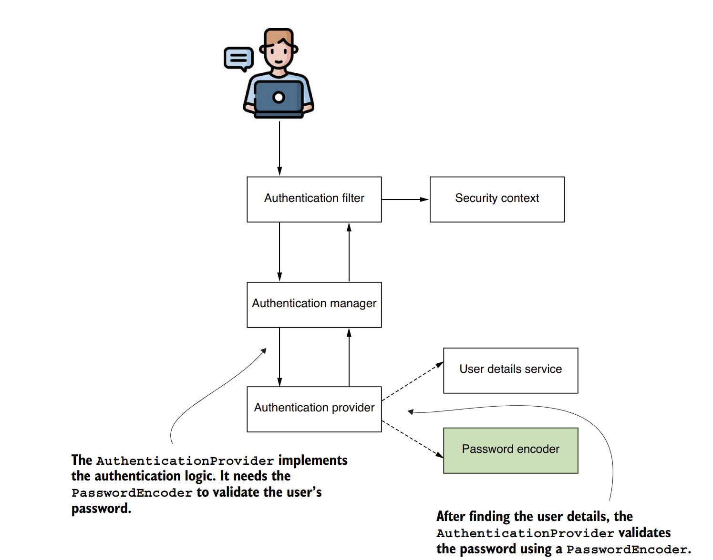
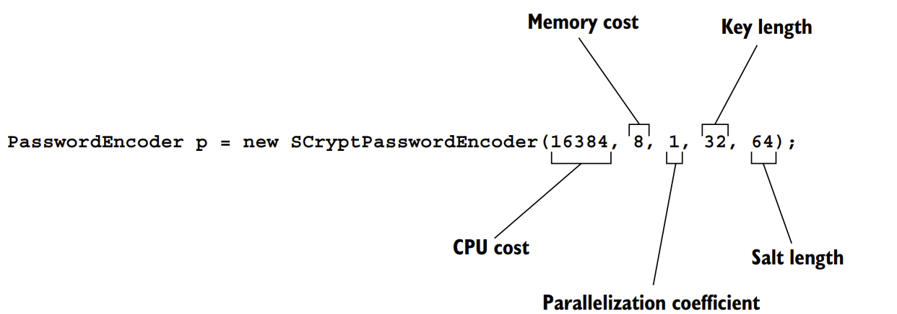
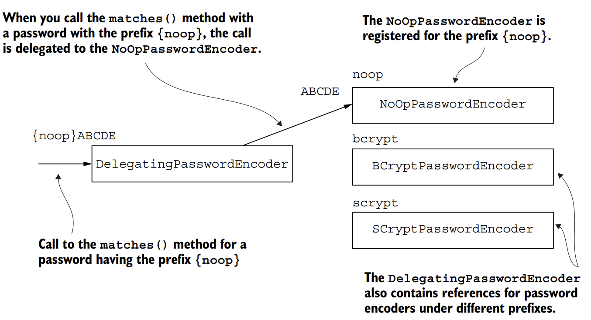
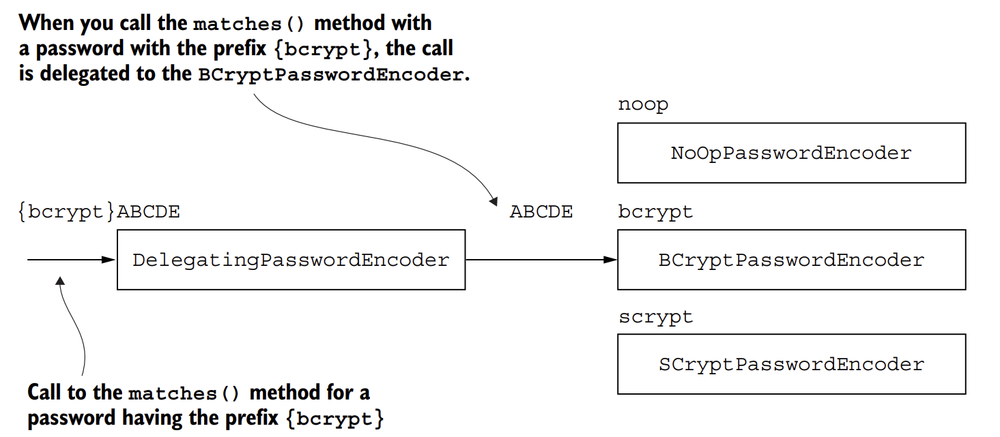

Where the PasswordEncoder fits into the authentication process.

The AuthenticationProvider uses the PasswordEncoder to validate the user's password in the authentication process.</br></br>
Because in general, a system doesn't manage password in plain text, these usually undergo a sort of transformation that makes it more challenging to read and steal them. For this responsibility, Spring Security defines a separate contract. 
To explain it simply in this section. I provide plenty of code examples related to the PasswordEncoder implementation. We'll start with understanding the contract, and then we'll write our implementation in a project.</br></br>
1. PasswordEncoder contract</br>
In this section, we discuss the definition of the PasswordEncoder contract. You implement this contract to tell Spring Security how to validate a user's password. In the authentication process, the PasswordEncoder decides whether a password is valid. 
Every system stores passwords encoded in some way. You preferably store them hashed so that there's no chance someone can read them. The PasswordEncoder can also encode passwords. The method encode() and matches(), which the contract declares, are actually the definition of its responsibility. Both are parts of the same contract because these are strongly interlinked.
The way the application encodes a password is related to the way the password is validated. Let's first review the contents of the PasswordEncoder interface:

```java
public interface PasswordEncoder{
    String encode (CharSequence rawPassword);
    boolean matches (CharSequence rawPassword, String encodedPassword);
    
        default boolean upgradeEncoding(String encodedPassword){
        return false;
    }
}
```
The interface defines two abstract methods and one with a default implementation.
The abstract encode() and matches() methods are also the ones that you most often here about when dealing with a PasswordEncoder implementation.</br>
The purpose of the encode (CharSequence rawPassword) method is to return a transformation of a provided string. In terms of Spring Security functionality, it's used to provide encryption or a hash for a given password. You can use the matches (CharSequence rawPassword, String encodedPassword) method afterward to check whether an encoded string matches a raw password. 
You use the matches() method in the authentication process to test a provided password against a set of known credentials. The third method, called upgradeEncoding(String encodedPassword), defaults to false in the contract. 
If you override it to return true, then the encoded-password is encoded again for better security.</br></br>
In some cases, encoding the encoded password can make it more challenging to obtain the cleartext password from the result. In general, this is a kind of obscurity that I personally don't like. But the framework offers this possibility if you think it applies to your case.
2. Implementing your PasswordEncoder:</br>
As you observed, the two methods matches() and encode() have a strong relationship. If you override them, you should always correspond in terms of functionality: a string returned by the encode() method should always be verifiable with the matches() method of the same PasswordEncoder. 
In this section, you'll implement the PasswordEncoder contract and define the two abstract methods declared by the interface. Knowing how to implement the PasswordEncoder, you can choose how the application manages passwords for the authentication process. The most straightforward implementation is a password encoder that considers passwords in a plain text: that is, it doesn't do any encoding on the password.</br>
Managing passwords in cleartext is what the instance of NoOpPasswordEncoder is percisely. It would look something like the following listing.
```java
public class PlainTextPasswordEncoder implements PasswordEncoder {
    
    @Override
    public String encode(CharSequence rawPassword){
        return rawPassword.toString();
    }
    
    @Override
    public boolean matches(CharSequence rawPassword, String encodedPassword){
        return rawPassword.equals(encodedPassword);
    }
}
```
The result of encoding is always the same as the password. SO to check if these match, you only need to compare the strings with equals(). A simple implementation of PasswordEncoder that uses the hashing algorithm SHA-512 looks like:

```java

public class Sha512PasswordEncoder implements PasswordEncoder {
    @Override
    public String encode(CharSequence rawPassword) {
        return hashWithSHA512(rawPassword.toString());
    }

    private String hashWithSHA512(String password) {
        StringBuilder result = new StringBuilder();
        try {
            MessageDigest md = MessageDigest.getInstance("SHA-512");
            byte[] digested = md.digest(password.getBytes());
            for (byte b : digested) {
                result.append(Integer.toHexString(0xFF & b));
            }
        }catch (NoSuchAlgorithmException e){
            throw new RuntimeException("Bad algorithm");
        }
        return result.toString();
    }

    @Override
    public boolean matches(CharSequence rawPassword, String encodedPassword) {
        String hashedPassword = encode(rawPassword);
        return encodedPassword.equals(hashedPassword);
    }
}

```
We use a method to hash the string value provided with SHA-512. I omit the implementation of this method.
We can call this method from the encode() method, which now returns the hash value for its input. To validate a hash against an input, the matches() method hashes the raw password in its input and compares it for equality with the hash against which it does the validation.
3. Choosing from the provided PasswordEncoder implementations:</br>
PasswordEncoder is powerful, you must also be aware that Spring Security already provides you  with some advantageous implementations. If one of these matches your application, you don't need to rewrite it. The PasswordEncoder implementation options that Spring Security provides. These are:
- NoOpPasswordEncoder - Doesn't encode the password but keeps it in cleartext. We use this implementation only for examples. Because it doesn't hash the password, you should never use it in a real-world scenario.
- StandardPasswordEncoder - Use SHA-256 to hash the password. This implementation is now deprecated, and you shouldn't use it for your new implementations. It's deprecated because it uses a hashing algorithm that we don't consider strong enough anymore, but you might still find this implementation used in existing applications. Preferably, if you find it in existing apps, you should change it with some other, more powerful password encoder.
- Pbkdf2PasswordEncoder- Use the password-based key derivation function 2 (PBKDF2).
- BCryptPasswordEncoder - Use a bcrypt strong hashing function to encode password.
- SCryptPasswordEncoder - Use a scrypt hashing function to encode the password.
The NoOpPasswordEncoder doesn't encode the password. It has an implementation similar to the PlainTextPasswordEncoder. For this reason, we only use this password encoder with theoretical examples. Also, the NoOpPasswordEncoder class is designed as a singleton. You can't call its constructor directly from outside the class, but you can use the NoOpPasswordEncoder.getInstance() method to obtain the instance of the class like this:

```java
import org.springframework.security.crypto.password.NoOpPasswordEncoder;
import org.springframework.security.crypto.password.PasswordEncoder;

PasswordEncoder p = NoOpPasswordEncoder.getInstance();
```
The StandardPasswordEncoder implementation provided by Spring Security uses SHA-256 to hash the password. For the StandardPasswordEncoder, you can provide a secret used in the hashing process. You set the value of this secret by the constructor's parameter. If you choose to call  the no-arguments constructor, the implementation uses the empty string as a value for the key. However, the StandardPasswordEncoder is deprecated now, and I don't recommend that you use it with your new implementations. You can find older applications or legacy code that still use it, so you should be aware of it. How to create instance of this password encoder:

```java
import org.springframework.security.crypto.password.PasswordEncoder;
import org.springframework.security.crypto.password.StandardPasswordEncoder;

PasswordEncoder p = new StandardPasswordEncoder();
PasswordEncoder p = new StandardPasswordEncoder("secret");
```
Another option offered by Spring Security is the Pbkdf2PasswordEncoder implementation that uses the PBKDF2 for password encoding. To create instances of the Pbkdf2PasswordEncoder, you have the following option:

```java
import org.springframework.security.crypto.password.PasswordEncoder;
import org.springframework.security.crypto.password.Pbkdf2PasswordEncoder;

PasswordEncoder p = new Pbkdf2PasswordEncoder("secret", 16, 310000, Pbkdf2PasswordEncoder.SecretKeyFactoryAlgorithm.PBKDF2WithHmacSHA256);
```
The PBKDF2 is pretty easy,slow-hashing function that performs an HMAC as many times as specified by an iteration argument. The first three parameters received by the last call are the value of a key used for the encoding process, the number of iterations used to encode the password, and the size of the hash. 
The second and third parameters can influence the strength of the result. The fourth parameters gives the hash width. You can choose the following options:
- PBKDF2WithHmacSHA1
- PBKDF2WithHmacSHA256
- PBKDF2WithHmacSHA512

It is possible to choose more or fewer iterations, as well as the length of the result. The longer the hash, the more powerful the password (the same is true for the hash width).
However, be aware that performance is affected by these values: the more iterations, the more resources your application consumes.
You should make a wise compromise between the resources consumed for generating the hash and the needed strength of the encoding </br></br>
Another excellent option offered by Spring Security is the BCryptPasswordEncoder, which uses a bcrypt string hashing function to encode the password.
You can instantiate the BCryptPasswordEncoder by calling the no-arguments constructor. However, you also have the option to specify a strength coefficient representing the log rounds (logarithmic rounds) used in the encoding process. 
Moreover, you can also alter the SecureRandom instance used for encoding:

```java
import org.springframework.security.crypto.bcrypt.BCryptPasswordEncoder;
import org.springframework.security.crypto.password.PasswordEncoder;

import java.security.SecureRandom;

PasswordEncoder p = new BCryptPasswordEncoder();
PasswordEncoder p = new BCryptPasswordEncoder(4);

SecureRandom s = SecureRandom.getInstanceStrong();
PasswordEncoder p = new BCryptPasswordEncoder(4,s);
```
The log rounds value that you provide affects the number of iterations the hashing operation uses. The number of iterations used is 2^log rounds. For the iteration number computation, the value for a log rounds can only be between 4 and 31. You can specify this by calling one of the second or third overloaded constructors.</br</br>
The last option is the SCryptPasswordEncoder. This password encoder uses a scrypt hashing function. For the ScryptPasswordEncoder, you have the option to create its instance:

4. Multiple encoding strategies with DelegatingPasswordEncoder:</br>
In this section, we discuss the cases in which an authentication flow must apply various implementations for matching the passwords. How to apply a useful tool that acts as a PasswordEncoder in your application. Instead of having its own implementation, this tools delegates to other objects that implement the PasswordEncoder interface.</br></br>
In some applications, you might find it useful to have various password encoders and choose from these depending on some specific configuration. A common scenario in which I find the DelegatingPasswordEncoder in production applications is when the encoding algorithm is changed, starting with a particular version of the application. Imagine somebody finds a vulnerability in the currently used algorithm, and you want to change it for newly registered users, but you don't want to change it for existing credentials. You end up having multiple kinds of hashes. How do you manage this situation? While it isn't the only approach for this scenario, a good choice is to use a DelegatingPasswordEncoder object.</br></br>
The DelegatingPasswordEncoder is an implementation of the PasswordEncoder interface that, instead of implementing its encoding algorithm, delegates to another instance of an implementation of the same contract. The hash starts with a prefix naming the algorithm used to define that hash. The DelegatingPasswordEncoder delegates to the correct implementation of the PasswordEncoder based on the prefix of the password.</br></br>
The DelegatingPasswordEncoder has a list of PasswordEncoder instances to which it delegates. The DelegatingPasswordEncoder stores each of the instances in a map. The NoOpPasswordEncoder is assigned to the key noop, while the BCryptPasswordEncoder implementation is assigned the key bcrypt. When the password has the prefix {noop}, the DelegatingPasswordEncoder delegates the operation NoOpPasswordEncoder implementation. If the prefix is {bcrypt}, then the action is delegated to the BCryptPasswordEncoder implementation.</br></br>

</br>
</br>
How to find define a DelegatingPasswordEncoder. You start by creating a collection of instances of your desired PasswordEncoder implementations, and you put these together in a DelegatingPasswordEncoder:
```java
@Configuration
public class DelegatingPasswordEncoderConfig {
    // Omitted code
    @Bean
    public PasswordEncoder passwordEncoder() {
        Map<String, PasswordEncoder> encoders = new HashMap<>();
        encoders.put("bcrypt", new BCryptPasswordEncoder());
        encoders.put("noop", NoOpPasswordEncoder.getInstance());
        encoders.put("scrypt", new SCryptPasswordEncoder(16384, 8,1, 32, 64));

        return new DelegatingPasswordEncoder("bcrypt",encoders);
    }
}
```
The DelegatingPasswordEncoder is just a tool that acts as a PasswordEncoder, so you can use it when you have to choose from a collection of implementations.
DelegatingPasswordEncoder contains references to a NoOpPasswordEncoder, a BCryptPasswordEncoder, and an SCryptPasswordEncoder, and delegates the default to the BCryptPasswordEncoder implementation.
Based on the prefix of the hash, the DelegatingPasswordEncoder uses the right PasswordEncoder implementation to match the password. This prefix has the key that identifies the password encoder to be used from the map of encoders. If there is no prefix, the DelegatingPasswordEncoder uses the default encoder. 
The default PasswordEncoder is the one gives as the first parameter when constructing the DelegatingPasswordEncoder instance. For the previous code, the default PasswordEncoder is bcrypt.</br></br>
***NOTE***: The curly braces are part of the hash prefix, and those should surround the name of the key. For example, if the provided hash is {noop}12345, the DelegatingPasswordEncoder delegates to the NoOpPasswordEncoder that we registered for the prefix noop.
Remember that the curly braces are mandatory in the prefix.</br></br>
If the hash looks like the next code snippet, the password encoder is the one we assign to the prefix {bcrypt}, which is the BCryptPasswordEncoder.
This is also the one to which the application will delegate if there is no prefix at all because we defined it as the default implementation:</br>
```text
{bcrypt}$2a$10$xn3LI/AjqicFYZFruSwve.681477XaVNaUQbr1gioaWPn4t1KsnmG
```
For convenience, Spring Security offers a way to create a DelegatingPasswordEncoder that has a map to all the standard provided implementations of PasswordEncoder.
The PasswordEncoderFactories class provides a createDelegatingPasswordEncoder() static method that returns an implementation of DelegatingPasswordEncoder with a full set of PasswordEncoder mappings and bcrypt as a default encoder:</br>

```java
import org.springframework.security.crypto.factory.PasswordEncoderFactories;
import org.springframework.security.crypto.password.PasswordEncoder;

PasswordEncoder passwordEncoder = PasswordEncoderFactories.createDelegatingPasswordEncoder();
```
**Encoding vs. encrypting vs.hashing**</br></br>
Encoding refers to any transformation of a given input. For example, if we have a function x that reverses a string, function x -> y applied to ABCD produces DCBA.</br></br>
Encryption is a particular type of encoding in which, to obtain the output, we provided both the input value and a key.
The key makes it possible to choose afterward who should be able to reverse the function (obtain the input from the output).
The simplest form of representing encryption as a function is </br>
(x,k) -> y</br>
where x is the input, k is the key, and y is the result of the encryption. This way, an individual who knows the key can use a known function to obtain the input from the output </br>
(y,k) -> x </br>
We call this reverse function decryption. If the key used for encryption is the same as the one used for decryption, we usually call it a symmetric key.
If we gave two different keys for encryption ((x, k1) -> y) and decryption ((y, k2)-> x), then we say that the encryption is done with asymmetric keys. Then (k1, k2) is called a key pair.
The key used for encryption is k1, is also referred to as the public key, while k2 is known as the private key. 
This way, only the owner of the private key can decrypt the data.</br></br> 
Hashing is a particular type of encoding, except the function is only one way. That is, from an output y of hashing function, you cannot get back the input. However, there should always be a way to check if an output y corresponds to an input x so we can understand the hashing as a pair of functions for encoding and matching.
If hashing function is x -> y, then we should also have a matching function (x,y) -> boolean.</br></br>
Sometimes, the hashing function could also use a random value added to the input (x,k) -> y. 
We refer to this value as the *salt*. The salt makes the function stronger, enforcing the difficulty of applying a reverse function to obtain the input from the result. </br></br></br>
Summarize the contracts we have discussed and applied up to now
- UserDetails - represents the user as seen by Spring Security
- GrantedAuthority - defines an action withing the purpose of the application is allowable to the user (for example, read, write, delete, ...)
- UserDetailsService - represents the object used to retrieve user details by username.
- UserDetailsManager - A more particular contract for UserDetailsService. Besides retrieving the user by username, it can also be used to mutate a collection of users or a specific user.
- PasswordEncoder - Specifies how the password is encrypted or hashed and how to check whether a give encoded string matches a plaintext password.</br></br>

**5. Taking advantage of the Spring Security Crypto module**

Spring Security Crypto module (SSCM), which is the part of Spring Security that deals with cryptography. Using encryption and decryption functions and generating keys isn't offered out of the box with the Java language,
which constrains developers when adding dependencies that provide a more accessible approach to these features.
Spring Security also provides its own solution, which enables you to reduce the dependencies of your projects by eliminating the need to use a separate library.
The password encoder are also part of SSCM, even if we have treated them separately. 
What other options the SSCM offers that related to cryptography.
How to use two essential features from the SSCM:
- Key generators - Objects used to generate keys for hashing and encryption algorithms.
- Encryptors - Objects used to encrypt and decrypt data.

**6.Using key generators**

The key generator is an object used to generate a specific kind of key, generally required for an encryption or hashing algorithm.
The implementations of key generators that Spring Security offers are great utility tools.
You'll prefer to use these implementations rather than adding another dependency to your application.

Two interfaces represent the two main types of key generators: BytesKeyGenerator and StringKeyGenerator. We can build them directly by making use of the factory class KeyGenerators.
You can use a string key generator, represented by the StringKeyGenerator contract, to obtain a key as a string. 
Usually, we use this key as a salt value for a hashing or encryption algorithm. You can find the definition of the StringKeyGenerator contract:
```java
public interface StringKeyGenerator{
    String generateKey();
}
```
The generator has only a generatedKey() method that returns a string representing the key value. 
How to obtain a StringKeyGenerator instance and how to use it to get a salt value:

```java
import org.springframework.security.crypto.keygen.KeyGenerators;
import org.springframework.security.crypto.keygen.StringKeyGenerator;

StringKeyGenerator keyGenerator = KeyGenerators.string();
String salt = keyGenerator.generateKey();
```

The generator creates an 8-byte key, and it encodes that as a haxadecimal string.
The method returns the result of these operations as a string.
The second interface describing a key generator is the BytesKeyGenerator, which is defined as follows
```java
public interface BytesKeyGenerator{
    
    int getKeyLength();
    byte[] generateKey();
}
```