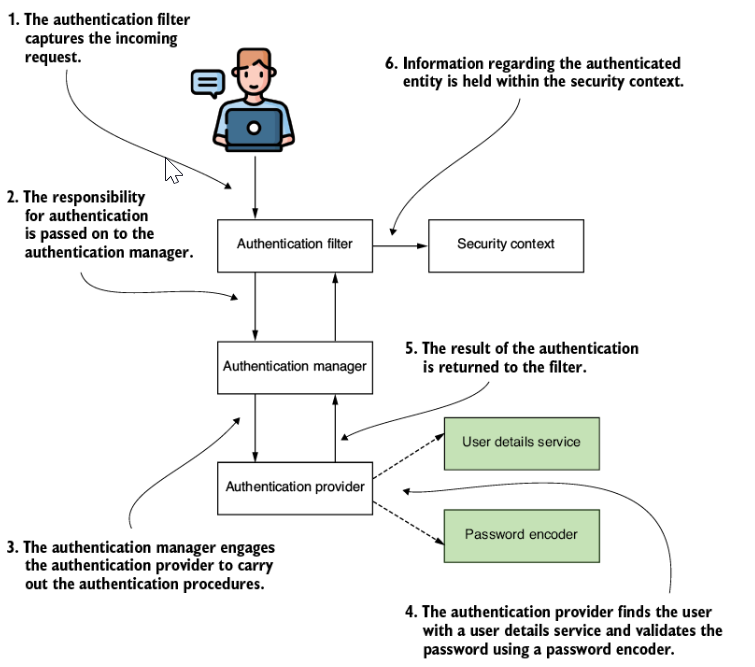
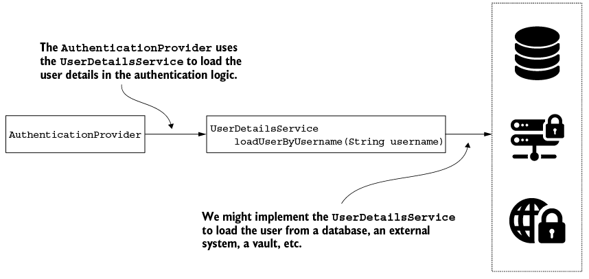
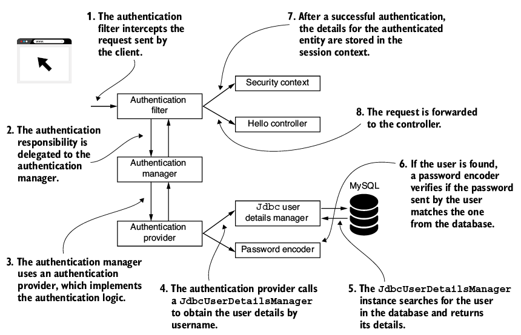

## This project covers:
- Describing a user with the UserDetails interface
- Using the UserDetailsService in the authentication flow
- Creating a custom implementation of the UserDetailsService
- Creating a custom implementation of the UserDetailsManger **
- Using the JdbcUserDetailsManagers in the authentication flow.

## 
- UserDetails, which describes the user for Spring Security
- GrantedAuthority, which allows us to define actions that the user can execute.
- UserDetailsManager, which extends the UserDetailsService contract. Beyond the inherited behaviors, it also describes actions such as creating a user, modifying or deleting a user's password.

## Implementing authentication in Spring Security

- This architecture is the backbone of the authentication process as implemented by Spring Security.
- It's important to understand it because you'll rely on it in any Spring Security implementation.
- The shaded boxes represent the components that we start with: the UserDetailsService and PasswordEncoder.
- The AuthenticationFilter captures the incoming request and passes the task of authentication to AuthenticationManger.
- The AuthenticationManager, in turn, utilizes an AuthenticationProvider to carry out the Authentication process.
- For verifying username and password, the AuthenticationProvider relies on a UserDetailsService and PasswordEncoder.
- The UserDetailsService is only responsible for retrieving the user by username.
- This action is the only one needed by the framework to complete authentication.
- The UserDetailsManager adds behaviors that refers to adding, modifying or deleting user, which is a required functionality in almost applications.
- The separation between two contracts is an excellent example of the *interface segregation principle*
- Separating the interfaces allows for better flexibility because the framework doesn't force you to implement behavior if your app doesn't need it.
- If the app only needs to authenticate the users, then implementing the UserDetailsService contract is enough to cover the desired functionality.
- To manage the users, the UserDetailsService and the UserDetailsManager components need a way to represent them.
- Spring Security offers the UserDetails contact, which you must implement to describe a user in the way the framework understand.
- In Spring Security, a user has a set of privileges, which are the actions the user allowed to do.
- Spring Security represents the actions that a user can do with the GrantedAuthority interface. We often call these authorities, a user has one or more of them.

- The UserDetailsService retrieves a user's details by searching for the user by name.
- The user is characterized by the UserDetails contract.
- Each user processes one or more authorities, which are depicted by the GrantedAuthority interface
- For incorporating operations such as create, delete, or modify password for a user, the UserDetailsManager contract, which expands on the UserDetailsService, is used to include these functionalities.
## Describing the user
- A user definition should fulfill the UserDetails contract.
- The UserDetails contract represents the user as understood by Spring Security.
- The class of your application that describes the user must implement this interface, and in this way, the framework understands it.
```java
public interface UserDetails extends Serializable {
  String getUsername();                                        
  String getPassword();
  Collection<? extends GrantedAuthority> getAuthorities();     
  boolean isAccountNonExpired();                               
  boolean isAccountNonLocked();
  boolean isCredentialsNonExpired();
  boolean isEnabled();
}
```
- The app uses these values (username and password) in the authentication process, and these are only details related to authentication from this contract.
- The other five methods all relate to authorizing the user access the application's resources.
- Generally, the app should allow a user to do some actions that are meaningful in the application's context.
- For example, the user should be able to read, write, or delete data.
- An authority represents the privilege a user has.
- We implement the getAuthorities() method to return the group of granted authorities to a user.
- *Note*: The names of last four methods in UserDetails interface may sound strange.
  - One could argue that these are no wisely choose in terms of clean coding and maintainability.
  - For example, the name isAccountNonExpired() looks like a double negation, and at first sight, it might create confusion.
  - There are named so that they all return false when the authentication should fail and true otherwise.
  - This is right approach because the human mind tends to associate the word "false" with negativity and the word "true" with positive scenarios.
## Detailing on the GrantedAuthority contract
- The actions granted for a user are called authorities.
- The authorities represent what the user can do in your application.
- Ao application might have users who can only read specific information, while others can also modify the data, depending on the functional requirements of the application.
- To describe the authorities in Spring Security, use the GrantedAuthority interface.
- We use the GrantedAuthority interface in the definition of the user details. It represents a privilege granted to the user.
- A user must have at least one authority.
```java
public interface GrantedAuthority extends Serializable {
    String getAuthority();
}
```
- To create an authority, you only need to find a name for that privilege. 
- The GrantedAuthority interface has only one abstract method, we can use a lambda expression for its implementation.
- Another possibility is to use the SimpleGrantedAuthority class to create authority instances
- The SimpleGrantedAuthority class offers a way to create immutable instances of the type GrantedAuthority. You provide the authority name when building the instance
- Two examples of implementing a GrantedAuthority
```java
GrantedAuthority g1 = () -> 'READ';
GrantedAuthority g2 = new SimpleGrantedAuthority('READ');
```

## Writing a minimal implementation of UserDetails
- We start with basic implementation in which each method returns a static value.
```java
public class DummyUser implements UserDetails {

  @Override
  public String getUsername() {
    return "Bao";
  }

  @Override
  public String getPassword() {
    return '12345';
  }

  // Omitted code
  @Override
  public Collection<? extends GrantedAuthority> getAuthorities() {
    return List.of(() -> 'READ');
  }
}
```
- It's a good start to understanding the contract, but not something you would do in a real application.
- For a real application, you should create a class that you can use to generate instance that can represent different users
```java
public class SimpleUser implements UserDetails {

  private final String username;
  private final String password;

  public SimpleUser(String username, String password) {
    this.username = username;
    this.password = password;
  }

  @Override
  public String getUsername() {
    return this.username;
  }

  @Override
  public String getPassword() {
    return this.password;
  }

  // Omitted code

}
```
## Using a builder to create instance of UserDetails type
- Some applications are simple and don't need a custom implementation of the UserDetails interface
- Instead of declaring one mỏe class in your application, you quickly obtain an instance representing your user with the User builder class.
- The User class from the org.springframework.security.core.userdetails package is a simple way to build instances of the UserDetails type.
- Using this class, you can create immutable instances of UserDetails
- You need to provide at least a username and a password, and the username shouldn't be an empty string
- Building the user in this way, you don't need to have a custom implementation of the UserDetails contract.
```java
UserDetails u = User.withUsername("Bao")
                .password("12345")
                .authorities("read", "write")
                .accountExpired(false)
                .disabled(true)
                .build();
```
- the User.withUsername(String username) method returns an instance of the builder class UserBuilder nested in the User class.
```java
User.UserBuilder builder1 = User.withUsername("bill");        

UserDetails u1 = builder1
                 .password("12345")
                 .authorities("read", "write")
                 .passwordEncoder(p -> encode(p))             
                 .accountExpired(false)
                 .disabled(true)
                 .build();                                    

User.UserBuilder builder2 = User.withUserDetails(u);          

UserDetails u2 = builder2.build();
```
- Builds a user with their username
- The password encoder is only a function that does an encoding
- At the end of the build pipeline, calls the build() method
- you can also build a user from an existing UserDetails instance.
- It is possible to use the builder to obtain a user represented by the UserDetails contract.
- At the end of the build pipeline, the build() method applies defined to encode the password if you provide one, constructs the instance of UserDetails and returns it.
- ## Note: the password encoder is given here as a Function<String,String> and not in the form of the PasswordEncoder interface provided by String Security.
  - This function's only responsibility is to transform a password in a give encoding

## Combining multiple responsibilities related to the user
```java
@Entity
public class User {

  @Id
  private Long id;
  private String username;
  private String password;
  private String authority;

  // Omitted getters and setters

}
```
- If you make the same class also implement the Spring Security contract for user details, the class becomes more complicated. It is a mess, don't do it
- Try to separate those by defining a separate class called SecurityUser, which adapts the User class.
- SecurityUser class implements the UserDetails contract and ues that to plug our user into the Spring Security architecture.
- The User class has only its JPA entity responsibility.
- We implement the SpringUser class to wrap the User entity.
```java
public class SecurityUser implements UserDetails {

  private final User user;

  public SecurityUser(User user) {
    this.user = user;
  }

  @Override
  public String getUsername() {
    return user.getUsername();
  }

  @Override
  public String getPassword() {
    return user.getPassword();
  }

  @Override
  public Collection<? extends GrantedAuthority> getAuthorities() {
    return List.of(() -> user.getAuthority());
  }

  // Omitted code

}
```
- To mark the fact that the SecurityUser makes no sense without a User entity, we make the field final
- You have to provide the user through the constructor.
- You can find different approaches to separate the two responsibilities.
- The approach I present in this section is no the best or the only one.
- Just remain the main idea: avoid mixing responsibilities and try to write your code to be as decoupled as possible to increase the maintainability of your app.

# Instructing Spring Security on how to manage users
## Understanding the UserDetailsService contract
- The UserDetailsService interface contains only one method, as follows:
```java
public interface UserDetailsService {

  UserDetails loadUserByUsername(String username) 
      throws UsernameNotFoundException;
}
```
- The authentication implementations calls the loadUserByUsername(String username) method to obtain the details of a user with a give username.
- The username is, of course, considered unique.
- The user returned by this method is an implementation of the UserDetails contract.
- If the username doesn't exist, the method throws a UsernameNotFoundException.
  - *NOTE*: The UsernameNotFoundException is a RuntimeException. The throws clause in the UserDetailsService is only for  documentation purpose.
  - The UsernameNotFoundException inherits directly from the type AuthenticationException, which is the parent of all the exceptions related to the process of authentication.
  - AuthenticationException further inherits the RuntimeException class.

- The AuthenticationProvider is the element responsible for executing the authentication process and utilizes the UserDetailsService to gather user details. It invokes the loadUserByUsername(String username) method to locate the user based on their username.
## Implementing the UserDetailsService contract
- In the next example, we write a UserDetailsService that has an in-memory list of users
```java
public class User implements UserDetails {

  private final String username;                    ①
  private final String password;
  private final String authority;                   ②

  public User(String username, String password, String authority) {
    this.username = username;
    this.password = password;
    this.authority = authority;
  }

  @Override
  public Collection<? extends GrantedAuthority> getAuthorities() {
    return List.of(() -> authority);                ③
  }

  @Override
  public String getPassword() {
    return password;
  }

  @Override
  public String getUsername() {
    return username;
  }

  @Override
  public boolean isAccountNonExpired() {            ④
    return true;
  }

  @Override
  public boolean isAccountNonLocked() {
    return true;
  }

  @Override
  public boolean isCredentialsNonExpired() {
    return true;
  }

  @Override
  public boolean isEnabled() {
    return true;
  }
}
```
- The User class is immutable. You give the values for three attributes when you build the instance, and these values cannot be changed afterward.
- To make the example simple, a user has only one authority.
- We create a class called InMemoryUserDetailsService. The following code shows how we implement this class.
```java
public class InMemoryUserDetailsService implements UserDetailsService {

  private final List<UserDetails> users;                          

  public InMemoryUserDetailsService(List<UserDetails> users) {
    this.users = users;
  }

  @Override
  public UserDetails loadUserByUsername(String username) 
    throws UsernameNotFoundException {

    return users.stream()
      .filter(     
         u -> u.getUsername().equals(username)
      )
      .findFirst()                                                
      .orElseThrow(                                               
        () -> new UsernameNotFoundException('User not found')
      );
   }
}
```
- UserDetailsService manages the list of users in-memory
- If there is such a user, returns it
- If a user with this username does not exist, throws an exception
- The loadUserByUsername(String username) method searches list of users for the given username and returns the desired UserDetails instance.
- If there is no instance with that username, it throws a UsernameNotFoundException.
- How we add it as a bean in configuration class and register one user within it.
```java
@Configuration
public class ProjectConfig {

  @Bean
  public UserDetailsService userDetailsService() {
    UserDetails u = new User("Bao", '12345', 'read');
    List<UserDetails> users = List.of(u);
    return new InMemoryUserDetailsService(users);
  }

  @Bean
  public PasswordEncoder passwordEncoder() {
    return NoOpPasswordEncoder.getInstance();
  }
}
```
- Finally, we create a simple endpoint to test the implementation.
```java
@RestController
public class HelloController {

  @GetMapping('/hello')
  public String hello() {
    return 'Hello!';
  }
}
```
- When calling the endpoint using cURL, we observe that for user Bao with password 12345, we get back an HTTP 200 OK. If we use something else, the application returns 401 Unauthorized
- curl -u Bao:12345 http://localhost:8080/hello

## Implementing the UserDetailsManager contract
- Spring Security needs the UserDetailsService contract to do the authentication. But generally, in applications, there is also a need for managing users. Most of the time, an app should be able to add new users or delete existing ones. In this case, 
we implement a more particular interface defined by Spring Security, UserDetailsManager. It extends UserDetailsService and adds more operations that we need to implement:
```java
public interface UserDetailsManager extends UserDetailsService {
  void createUser(UserDetails user);
  void updateUser(UserDetails user);
  void deleteUser(String username);
  void changePassword(String oldPassword, String newPassword);
  boolean userExists(String username);
}
```
- The InMemoryUserDetailsManager object that already we used is actually a UserDetailsManager
#### Using a JdbcUserDetailsManager for User Management
- Besides the InMemoryUserDetailsManager, we often use another UserDetailManager implementation, JdbcUserDetailsManager. The JdbcUserDetailsManager class manages users in an SQL database. It connects to the database directly through JDBC. This way, the JdbcUserDetailsManager is independent of any other framework or specification related to database connectivity.
- Example: implementing an application that manages the users in a MySQL using JdbcUserDetailsManager.

- Let start working on our demo application that uses the JdbcUserDetailsManager by creating a database and two tables. In our case, we name the database spring, and we name one of the tables users and the other authorities. 
These names are default the default table names known by JdbcUserDetailsManager. The JdbcUserDetailsManager implementation is flexible and lets you override these default names if you want to do so.
The purpose of the users table is to keep user records. The JdbcUserDetailsManager implementation expects three columns in the users table - a username, a password, and enabled -which you can use to deactivate the user.
- You can choose to create the database and its structure yourself by using either the command-line tool for your database management system (DBMS) or a client application. For example, for MySQL, you can choose to use MySQL Workbench to do this. But the easiest thing to do would be to let Spring Boot itself run the scripts for you. To do this. just add two more files to your project in the resource folder: schema.sql and data.sql. 
In the schema.sql file, you add the queries related to the database structure, such as creating, altering, or dropping tables. In the data.sql file, you add the queries that work with the data inside tha tables, such as  INSERT, UPDATE, or DELETE. Spring Boot automatically runs these files for you when you start the application. A simpler solution for building examples that need databases is using an H2 in-memory database.
This way, you don't need to install a separate DBMS solution.
```h2
CREATE TABLE IF NOT EXISTS 'spring'.'users' (
                                              `id` INT NOT NULL AUTO_INCREMENT,
                                              `username` VARCHAR(45) NOT NULL,
  `password` VARCHAR(45) NOT NULL,
  `enabled` INT NOT NULL,
  PRIMARY KEY (`id`));
```
```h2
CREATE TABLE IF NOT EXISTS 'spring'.'authorities' (
  `id` INT NOT NULL AUTO_INCREMENT,
  `username` VARCHAR(45) NOT NULL,
  `authority` VARCHAR(45) NOT NULL,
  PRIMARY KEY (`id`));
```
- To make sure you have a user for testing, insert a record in each of the tables. You can add these queries in the data.sql file the resources folder on the Spring Boot project:
```h2
INSERT INTO `spring`.`authorities` 
(username, authority) 
VALUES 
('Bao', 'write');
```
```h2
INSERT INTO `spring`.`users` 
(username, password, enabled) 
VALUES 
('Bao', '12345', '1');
```
For your project, you need to add at least the dependencies started in the following listing. Check your pom.xml
```xml
<dependencies>
  <dependency>
    <groupId>org.springframework.boot</groupId>
    <artifactId>spring-boot-starter-security</artifactId>
  </dependency>
  <dependency>
    <groupId>org.springframework.boot</groupId>
    <artifactId>spring-boot-starter-web</artifactId>
  </dependency>
  <dependency>
    <groupId>org.springframework.boot</groupId>
    <artifactId>spring-boot-starter-jdbc</artifactId>
  </dependency>
  <dependency>
    <groupId>com.h2database</groupId>
    <artifactId>h2</artifactId>
  </dependency>
</dependencies>
```
You can configure a data source in the application.properties file of the project or as a separate bean.
```properties
spring.datasource.url=jdbc:h2:mem:ssia
spring.datasource.username=sa
spring.datasource.password=
# this really important to auto use schema.sql and data.sql
spring.sql.init.mode=always
```
- In the configuration class of the project, you define the UserDetailsService and the PasswordEncoder. The JdbcUserDetailsManager needs the DataSource to connect to the database. The data source can be autowired through a param of the method or through an attribute of the class.
```java
@Configuration
public class ProjectConfig {

  @Bean
  public UserDetailsService userDetailsService(DataSource dataSource) {
    return new JdbcUserDetailsManager(dataSource);
  }

  @Bean
  public PasswordEncoder passwordEncoder() {
    return NoOpPasswordEncoder.getInstance();
  }
}
```
- To access any endpoint of the application, you now need to use HTTP Basic authentication with on of the users stored in the database.
- we create a new endpoint like this:
```java
@RestController
public class HelloController {

  @GetMapping('/hello')
  public String hello() {
    return 'Hello!';
  }
}
```
- You find the result when calling the endpoint with the correct username and password
  - curl -u Bao:12345 http://localhost:8080/hello
- The JdbcUserDetailsManager also allows you to configure the queries used. In the previous code, we made sure we used the exact names for the tables and columns, as the JdbcDetailsManager implementation expects those. But it could be that these name are not the best choice for your application. How to override the queries for the JdbcUserDetailsManager.
```java
@Bean
public UserDetailsService userDetailsService(DataSource dataSource) {
  String usersByUsernameQuery = 
     'select username, password, enabled from users where username = ?';
  String authsByUserQuery =
     'select username, authority from authorities where username = ?';

  var userDetailsManager = new JdbcUserDetailsManager(dataSource);
  userDetailsManager.setUsersByUsernameQuery(usersByUsernameQuery);
  userDetailsManager.setAuthoritiesByUsernameQuery(authsByUserQuery);
  return userDetailsManager;
}
```
In the same way, we can change all the queries used by the JdbcDetailsManager implementation.

**SUMMARY**:
- The UserDetails interface is the contract you use to describe a user in Spring Security.
- The UserDetailsService interface is the contract that Spring Security expects you to implement in the authentication architecture to describe the way the application obtains user details.
- The UserDetailsManager interface extends UserDetailsService and adds the behavior related to creating, changing, or deleting a user.
- Spring Security provides a few implementations of UserDetailsManager contract. Among these are InMemoryUserDetailsManager, JdbcUserDetailsManager, and LdapUserDetailsManager.
- The JdbcUserDetailsManager class has the advantage of directly using JDBC and does not lock the application into other frameworks.