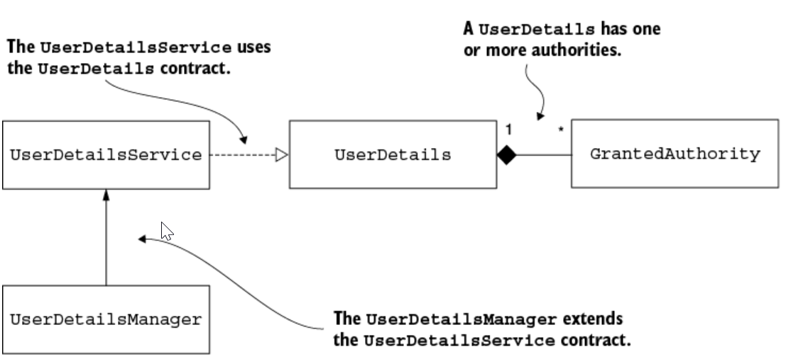

## This project covers:
- Describing a user with the UserDetails interface
- Using the UserDetailsService in the authentication flow
- Creating a custom implementation of the UserDetailsService
- Creating a custom implementation of the UserDetailsManger **
- Using the JdbcUserDetailsManagers in the authentication flow.

## 
- UserDetails, which describes the user for Spring Security
- GrantedAuthority, which allows us to define actions that the user can execute.
- UserDetailsManager, which extends the UserDetailsService contract. Beyond the inherited behaviors, it also describes actions such as creating a user, modifying or deleting a user's password.

## Implementing authentication in Spring Security

- This architecture is the backbone of the authentication process as implemented by Spring Security.
- It's important to understand it because you'll rely on it in any Spring Security implementation.
- The shaded boxes represent the components that we start with: the UserDetailsService and PasswordEncoder.
- The AuthenticationFilter captures the incoming request and passes the task of authentication to AuthenticationManger.
- The AuthenticationManager, in turn, utilizes an AuthenticationProvider to carry out the Authentication process.
- For verifying username and password, the AuthenticationProvider relies on a UserDetailsService and PasswordEncoder.
- The UserDetailsService is only responsible for retrieving the user by username.
- This action is the only one needed by the framework to complete authentication.
- The UserDetailsManager adds behaviors that refers to adding, modifying or deleting user, which is a required functionality in almost applications.
- The separation between two contracts is an excellent example of the *interface segregation principle*
- Separating the interfaces allows for better flexibility because the framework doesn't force you to implement behavior if your app doesn't need it.
- If the app only needs to authenticate the users, then implementing the UserDetailsService contract is enough to cover the desired functionality.
- To manage the users, the UserDetailsService and the UserDetailsManager components need a way to represent them.
- Spring Security offers the UserDetails contact, which you must implement to describe a user in the way the framework understand.
- In Spring Security, a user has a set of privileges, which are the actions the user allowed to do.
- Spring Security represents the actions that a user can do with the GrantedAuthority interface. We often call these authorities, a user has one or more of them.

- The UserDetailsService retrieves a user's details by searching for the user by name.
- The user is characterized by the UserDetails contract.
- Each user processes one or more authorities, which are depicted by the GrantedAuthority interface
- For incorporating operations such as create, delete, or modify password for a user, the UserDetailsManager contract, which expands on the UserDetailsService, is used to include these functionalities.
## Describing the user
- A user definition should fulfill the UserDetails contract.
- The UserDetails contract represents the user as understood by Spring Security.
- The class of your application that describes the user must implement this interface, and in this way, the framework understands it.
```java
public interface UserDetails extends Serializable {
  String getUsername();                                        
  String getPassword();
  Collection<? extends GrantedAuthority> getAuthorities();     
  boolean isAccountNonExpired();                               
  boolean isAccountNonLocked();
  boolean isCredentialsNonExpired();
  boolean isEnabled();
}
```
- The app uses these values (username and password) in the authentication process, and these are only details related to authentication from this contract.
- The other five methods all relate to authorizing the user access the application's resources.
- Generally, the app should allow a user to do some actions that are meaningful in the application's context.
- For example, the user should be able to read, write, or delete data.
- An authority represents the privilege a user has.
- We implement the getAuthorities() method to return the group of granted authorities to a user.
- *Note*: The names of last four methods in UserDetails interface may sound strange.
  - One could argue that these are no wisely choose in terms of clean coding and maintainability.
  - For example, the name isAccountNonExpired() looks like a double negation, and at first sight, it might create confusion.
  - There are named so that they all return false when the authentication should fail and true otherwise.
  - This is right approach because the human mind tends to associate the word "false" with negativity and the word "true" with positive scenarios.