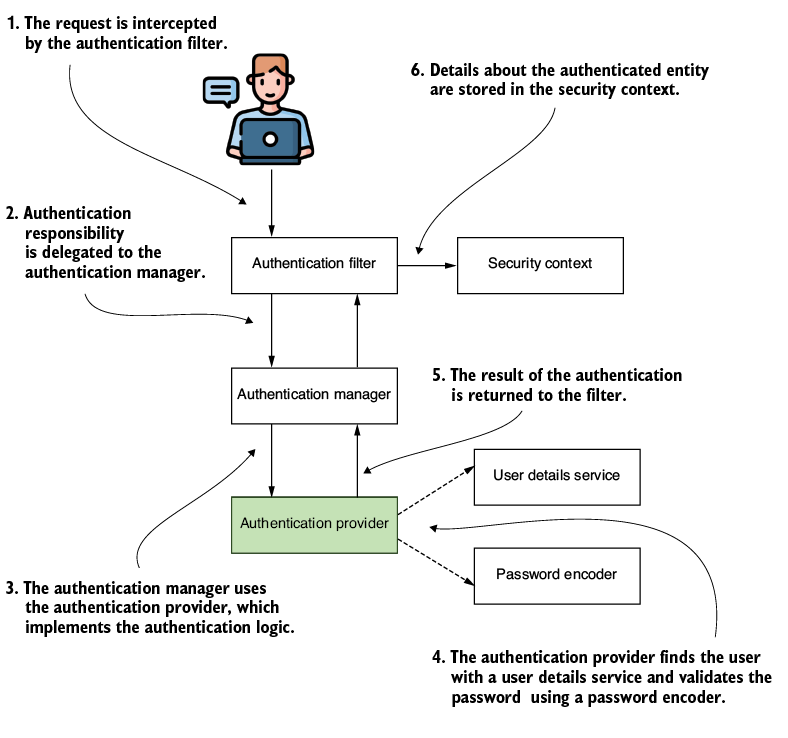

## This project covers:
- Creating your first project with Spring Security
- Designing simple functionalities using the basic components for authentication and authorization.
- Applying the basic contracts(interface) and understanding how they are correlated.
- Writing custom implementations for primary responsibilities.
- Overriding Spring Boot's default configuration for Spring Security.
## special information :
Java 10 introduced the reserved type name java. You can only use it for local declarations
## Overriding default configurations
- In some cases, developers choose to use beans in the Spring context for the configuration
- In other cases, they override various methods for the same purpose
- The speed with the Spring ecosystem evolved is probably one of the main factors that generated these multiple approaches. Configuring a project with a mix of styles is not desirable as it makes the code difficult to understand and affects the maintainability of the application.

## Customizing user details management
- InMemoryUserDetailsManager: The implementation stores credentials in memory, which then can be used by Spring Security to authenticate a request.
- ## Note InMemoryUserDetailsManager: 
  - An InMemoryUserDetailsManager implementation isn't meant for production-ready application, but it's an excellent tool for examples or proof of concepts.
  - In some cases, all you need is users.
  - You don't need to spend the time implementing this part of the functionality. In our case, we use it to understand how to override the default UserDetailsService implementation.
```java
@Configuration
public class ProjectConfig {
    @Bean
    UserDetailsService userDetailsService() {
    return new InMemoryUserDetailsManager();
    }
}

```
- We annotate the class with @Configuration. The @Bean annotation instructs Spring to add the instance returned by the method to the Spring context. If you execute the code exactly as it is now, you'll no longer see the autogenerated password in the console.
- The application now uses the instance of type UserDetailsService you added to the context instead of the default autoconfigured one. But, at the same time, you won't be able to access the endpoint anymore for two reasons:
  - You don't have any users
  - You don't have a PasswordEncoder
- We need to solve these issues by:
  - Create at least on user who has a set of credentials (username and password)
  - Add the user to be managed by our implementation of UserDetailsService
  - Define a bean of the type PasswordEncoder that our application can use to verify a give password with the one stored and manged by UserDetailsService.
  - First we declare and add a set of credentials that we can use for authentication to the instance of InMemoryUserDetailsManger
- When building the instance, we have to provide the username, the password, and at least on authority.
- I name the authority "read", because we won't use this authority for the moment, this name doesn't really matter.
```java
@Configuration
public class ProjectConfig {
    @Bean
    UserDetailsService userDetailsService() {
    var user = User.withUsername("john")
    .password("12345")
    .authorities("read")
    .build();
    return new InMemoryUserDetailsManager(user);
    }
}
```
- You'll find the class User in the org.springframework.security.core.userdetails package
- We have to provide a value for the username, one for the password, and at least one authority. But this is still not enough to allow us to call the endpoint. We also need to declare a PasswordEncoder.
- When using the default UserDetailsService, a PasswordEncoder is also autoconfigured. Because we override UserDetailsService, we also have to declare a PasswordEncoder.
- You'll see an exception when you call the endpoint. When trying to do the authentication, Spring Security realizes it doesn't know how to manage the password and fails
- The client gets back an HTTP 401 Unauthorized message and an empty response body:
  - curl -u Bao:12345 http://localhost:8080/hello
  - The result of the call in the app's console is:
    - java.lang.IllegalArgumentException: You have entered a password with no PasswordEncoder. If that is your intent, it should be prefixed with `{noop}`.
    - To solve this problem, we can add a PasswordEncoder bean in the context, the same as we did with the UserDetailsService. For this bean, we use an existing implementation of PasswordEncoder:
```java
@Bean
public PasswordEncoder passwordEncoder() {
    return NoOpPasswordEncoder.getInstance();
}
```
- The NoOpPasswordEncoder instance treats password as plain text. It doesn't encrypt or hash them.
- For matching, NoOpPasswordEncoder only compares the Strings using the underlying equals(Object o) method of the String class.
- You shouldn't use this type of PasswordEncoder in a production-ready app. NoOpPasswordEncoder is a good option for examples where you don't want to focus on the hashing algorithm of the password.
- Therefore, the developers of the class marked it as @Deprecated, and your development environment will show its name with a strikethrough.
- try again : curl -u Bao:12345 http://localhost:8080/hello
  - Hello World

## Applying authorization at the endpoint level
- With the default configuration, all endpoints assume you have a valid user managed by application. 
- Also, by default, your application uses HTTP Basic authentication, but you can easily override this configuration
- HTTP Basic authentication doesn't fit into most application architectures.
- Sometimes, we'd like to change it to match our application. 
- Similarly, not all endpoints of an application need to be secured, and for those that do, we might need to choose different authentication methods and authorization rules.
- To customize the handling of authentication and authorization, we will need to define a bean of type SecurityCHain
```java
@Configuration
public class ProjectConfig {

  @Bean
  SecurityFilterChain configure(HttpSecurity http) 
    throws Exception {

    return http.build();
  }

  // Omitted code
}
```
- We can then alter the configuration using different methods of the HttpSecurity object
```java
@Configuration
public class ProjectConfig {
  
  @Bean
  SecurityFilterChain configure(HttpSecurity http) 
    throws Exception {

      // Use HTTP Basic authentication
    http.httpBasic(Customizer.withDefaults());    

    http.authorizeHttpRequests(
            // All the requests require authentication
      c -> c.anyRequest().authenticated()           
    );

    return http.build();  
  }

  // Omitted code
}
```
- This code configures endpoint authorization with the same behavior as the default one
- With a slight change, you can make all the endpoints accessible without the need for credentials.
```java
@Configuration
public class ProjectConfig {

  @Bean
  public SecurityFilterChain configure(HttpSecurity http) 
    throws Exception {

    http.httpBasic(Customizer.withDefaults()); 
   
    http.authorizeHttpRequests(
            // None of the requests need to be authenticated
      c -> c.anyRequest().permitAll()    
    );

    return http.build();
  }

  // Omitted code
}
```
- The permitAll() call in the configuration, together with the anyRequest() method, makes all the endpoints accessible without the need for credentials
- curl http://localhost:8080/hello
  The response body of the call is : Hello World
- We used two configuration method:
  - httpBasic(), which helped us configure the authentication approach. By calling this method, you instructed your app to accept HTTP Basic as an authentication method
  - authorizeHttpRequests(), which helped us configure the authorization rules at the endpoint level. By calling this method, you instructed your app on how to authorize the request received on specific endpoints.
- For both methods, you had to use a Customizer object as a parameter. Customizer is a contract you implement to define the customization either Spring Security element you configure: The authentication, the authorization or particular protection mechanisms such as CSRF or CORS.
- Observe that Customizer is a functional interface(so we can use lambda expressions to implement it), and the withDefaults() method I used, in fact, just a Customizer implementation that does nothing
- In earlier Spring Security versions, you could apply configurations without a Customizer object by using a chaining syntax like this:
  - http.authorizeHttpRequests().anyRequest().authenticated()
- The reason this approach has been left behind is that a Customizer object allows you more flexibility in moving the configuration where needed.
- In real world apps, the configurations can grow a lot. In such cases, the ability to move these configurations in separate classes helps you to keep the configurations easier to maintain and test.
## Configuring in different ways
- One of the confusing aspects of creating configurations with Spring Security is having multiple ways to configure the same thing. In this section, you'll learn alternatives for configuring UserDetailsService and PasswordEncoder.
- It's essential to know the options you have.
- It's also important that you understand hơ and when to use these in your application. 
- We can directly use the SecurityFilterChain bean to set both the UserDetailsService and the PasswordEncoder
```java
    @Bean
    public SecurityFilterChain configure(HttpSecurity http) throws Exception {
        http.httpBasic(Customizer.withDefaults());
        http.authorizeHttpRequests(
                c -> c.anyRequest().permitAll()
        );

        var user = User.withUsername("Bao1")
                .password("12345")
                .authorities("read")
                .build();
        var userDetailsService = new InMemoryUserDetailsManager(user);

        http.userDetailsService(userDetailsService);
        return http.build();
    }
```
- The UserDetailsService is now done locally inside the bean method creating the SecurityFilterChain
- Full contents of the configuration class:
```java
@Configuration
public class ProjectConfig {

  @Bean
  SecurityFilterChain configure(HttpSecurity http) 
    throws Exception {
 
    http.httpBasic(Customizer.withDefaults());

    http.authorizeHttpRequests(
        c -> c.anyRequest().authenticated()
    );

    var user = User.withUsername('john')            
        .password('12345')
        .authorities('read')
        .build();

    var userDetailsService =  new InMemoryUserDetailsManager(user);

    http.userDetailsService(userDetailsService);     

    return http.build();
  }

  @Bean
  PasswordEncoder passwordEncoder() {
    return NoOpPasswordEncoder.getInstance();
  }
}
```
- Any of these configuration options are correct. The first option, where we add the beans to the context, lets you inject the values in another class where you might potentially need them.
- But if you don't need that for your case, the second option would be equally good.
## Defining custom authentication logic
- Spring Security components provide a lot of flexibility, offering many options when adapting them to the architecture of our application.
- AuthenticationProvider implements the authentication logic and delegates to the UserDetailsService and PasswordEncoder for user and password management.
- How to implement custom authentication logic with AuthenticationProvider ?
- Spring Security architecture is loosely coupled with fine-grained responsibilities.
- That design is one of the things that makes Spring Security flexible and easy to integrate with your applications.

- The AuthenticationProvider implements the authentication logic. it receives the request from the AuthenticationManager and delegates finding the user to a UserDetailsService, verifying the password to a PasswordEncoder.
```java
@Component
public class CustomAuthenticationProvider implements AuthenticationProvider {

  @Override
  public Authentication authenticate (Authentication authentication) throws AuthenticationException {

    // authentication logic here
  }

  @Override
  public boolean supports(Class<?> authenticationType) {

    // type of the Authentication implementation here
  }
}
```
- The authenticate method represents all the logic for authentication, so we'll add an implementation like this:
```java
@Override
public Authentication authenticate(
        Authentication authentication)
        throws AuthenticationException {

  String username = authentication.getName();      
  String password = String.valueOf(
          authentication.getCredentials());

  if ("Bao".equals(username) &&"12345".equals(password)) {
    return new UsernamePasswordAuthenticationToken(
            username,
            password,
            Arrays.asList());
  } else {
    throw new AuthenticationCredentialsNotFoundException('Error!');
  }

}
```
- The getName() method is inherited by Authentication from the Principal interface.
- This condition generally calls UserDetailsService and PasswordEncoder to test the username and password.
- Here the condition of the if-else clause is replacing the responsibilities of UserDetailsService and PasswordEncoder.
- You are not required to use the two beans, but if you work with users and passwords for authentication, I strongly suggest you separate the logic of their management.
- Apply it as the Spring Security architecture designed it, even when you override the authentication implementation.
- You might find it useful to replace the authentication logic by implementing your own AuthenticationProvider
```java
@Override
  public Authentication authenticate(
     Authentication authentication) 
       throws AuthenticationException {

      String username = authentication.getName();
      String password = String.valueOf(authentication.getCredentials());

      if ("Bao".equals(username) && 
          "12345".equals(password)) {
        return new UsernamePasswordAuthenticationToken(
             username, password, Arrays.asList());
      } else {
        throw new AuthenticationCredentialsNotFoundException("Invalid username or password");
      }
    }

    @Override
    public boolean supports(Class<?> authenticationType) {
        return UsernamePasswordAuthenticationToken
                   .class
                   .isAssignableFrom(authenticationType);
    }
```
- In the configuration class, you can register the AuthenticationProvider using the HttpSecurity authenticationProvider() method
```java
@Configuration
public class ProjectConfig {

  private final CustomAuthenticationProvider authenticationProvider;

  public ProjectConfig(
    CustomAuthenticationProvider authenticationProvider) {

    this.authenticationProvider = authenticationProvider;
  }

  @Bean
  SecurityFilterChain configure(HttpSecurity http) throws Exception {
    http.httpBasic(Customizer.withDefaults());
       
    http.authenticationProvider(authenticationProvider);

    http.authorizeHttpRequests(
      c -> c.anyRequest().authenticated()
    );

    return http.build();
  }
}
```
- call api : curl -u Bao:12345 http://localhost:8080/hello
## Using multiple configuration classes
- good practice to separate the responsibilities even for the configuration classes.
- It's always a good practice to have only one class per responsibility.
- For example: UserManagementConfiguration and WebAuthorizationConfig
```java
@Configuration
public class UserManagementConfig {

  @Bean
  public UserDetailsService userDetailsService() {
    var userDetailsService = new InMemoryUserDetailsManager();

    var user = User.withUsername('john')
                .password('12345')
                .authorities('read')
                .build();

    userDetailsService.createUser(user);
    return userDetailsService;
  }

  @Bean
  public PasswordEncoder passwordEncoder() {
    return NoOpPasswordEncoder.getInstance();
  }
}
```
- In this case, the UserManagementConfig class only contains two beans responsible for user management: UserDetailService and PasswordEncoder
```java
@Configuration
public class WebAuthorizationConfig {

  @Bean
  SecurityFilterChain configure(HttpSecurity http) 
    throws Exception {

    http.httpBasic(Customizer.withDefaults());

    http.authorizeHttpRequests(
        c -> c.anyRequest().authenticated()
    );

    return http.build();
  }
}
```
- WebAuthorizationConfig class needs to define a bean of type SecurityFilterChain to config the authentication and the authentication rules.
## Summary:
- Spring Boot provides some default configurations when you add Spring Security to the dependencies of the application.
- You implement the following basic components for authentication and authorization rules: UserDetailsService, PasswordEncoder and AuthenticationProvider.
- You can define users with User class. A user should at least have a username, a password and an authority. Authorities are actions that you allow a user to do in the context of the application.
- A simple implementation of UserDetailsService that Spring Security provides is InMemoryUserDetailsManager. You can add users to such an instance of UserDetailsService to manage the user in the application's memory.
- The NoOPPasswordEncoder is an implementation of the PasswordEncoder contract (interface)that uses passwords in cleartext. This sample is good for learning examples and (maybe) proofs of concept, but not for production-ready application.
- There are multiple ways to write configurations,